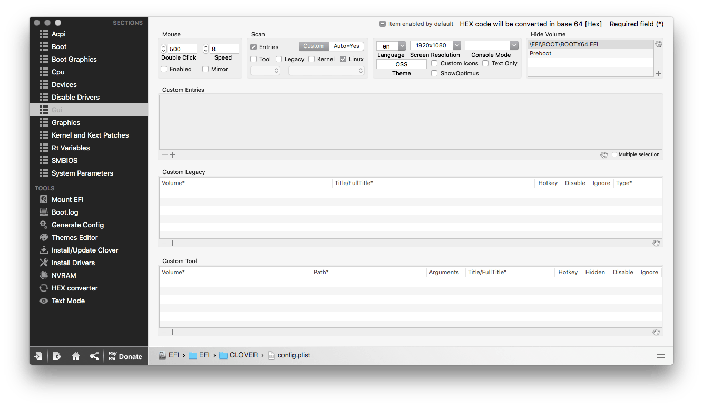

在安装完 Ubuntu 18.04 后，本人遇到了 Ubuntu 无法在 Clover 中显示的问题，解决方案在此记录下来。

<!--more-->

## 修改 Clover

将 Clover 中的 GUI - Scan 中的 Linux 选项勾选，如图



## 修改 Grub 等待时间

在 Linux 下修改 `/etc/default/grub` 文件（需要 root 权限），并运行 `sudo update-grub`。使其减少 grub 的等待时间，在这里我设置为 1s，可以将等待的秒数设置为更小，如 0.1s。但需要注意的是在 Ubuntu 18.04 不能设置为 0，参见 [How to set GRUB timeout to 0 on Ubuntu 18.04](https://askubuntu.com/questions/1036091/how-to-set-grub-timeout-to-0-on-ubuntu-18-04)

```
# If you change this file, run 'update-grub' afterwards to update
# /boot/grub/grub.cfg.
# For full documentation of the options in this file, see:
#   info -f grub -n 'Simple configuration'

GRUB_DEFAULT=0
GRUB_TIMEOUT_STYLE=hidden
GRUB_TIMEOUT=1
GRUB_DISTRIBUTOR=`lsb_release -i -s 2> /dev/null || echo Debian`
GRUB_CMDLINE_LINUX_DEFAULT="quiet splash"
GRUB_CMDLINE_LINUX=""

# Uncomment to enable BadRAM filtering, modify to suit your needs
# This works with Linux (no patch required) and with any kernel that obtains
# the memory map information from GRUB (GNU Mach, kernel of FreeBSD ...)
#GRUB_BADRAM="0x01234567,0xfefefefe,0x89abcdef,0xefefefef"

# Uncomment to disable graphical terminal (grub-pc only)
#GRUB_TERMINAL=console

# The resolution used on graphical terminal
# note that you can use only modes which your graphic card supports via VBE
# you can see them in real GRUB with the command `vbeinfo'
GRUB_GFXMODE=800x600

# Uncomment if you don't want GRUB to pass "root=UUID=xxx" parameter to Linux
#GRUB_DISABLE_LINUX_UUID=true

# Uncomment to disable generation of recovery mode menu entries
#GRUB_DISABLE_RECOVERY="true"

# Uncomment to get a beep at grub start
#GRUB_INIT_TUNE="480 440 1"
```

Gist 地址： https://gist.github.com/rwv/664461cddf87bdfc4a97bef900f20268

## 参考

- [Clover: manually add boot entry | tonymacx86.com](https://www.tonymacx86.com/threads/clover-manually-add-boot-entry.208906/)
- [How to set GRUB timeout to 0 on Ubuntu 18.04](https://askubuntu.com/questions/1036091/how-to-set-grub-timeout-to-0-on-ubuntu-18-04)
