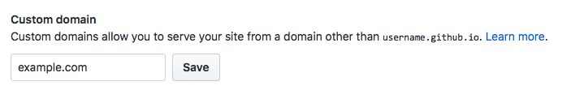
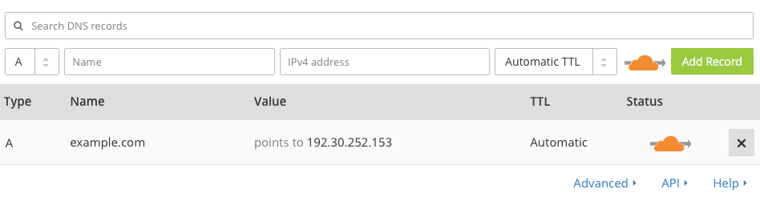
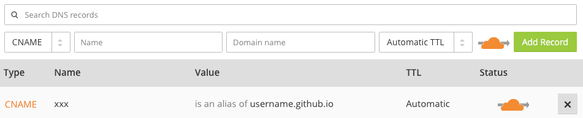

本博客使用 [Hexo](https://hexo.io) 和 [GitHub Pages](https://pages.github.com) 进行搭建，至于为何需要使用 [Cloudflare](https://www.cloudflare.com), 这是因为如今国内的网络环境 HTTP 劫持层出不穷，全站 HTTPS 也变得越来越流行且必要，Github Pages 虽也支持自定义域名，但其自定义域名并不支持 HTTPS。因此本站同时使用 [Cloudflare](https://www.cloudflare.com) 作为 HTTPS 和 CDN 工具。

<!--more-->

## 本文约定

GitHub repository 以 `username.github.io` 为例，请将 `username` 修改为自己的 GitHub 用户名。自定义域名以 `example.com` 为例，请自行修改为自己的域名。

## 搭建 Hexo

可参考 [Hexo 文档](https://hexo.io/zh-cn/docs/index.html) 进行安装

注： macOS 下 zsh 用户使用 homebrew 安装可能会出现无法自动配置环境变量的情况，需要在终端下执行

```bash
$ mkdir ~/.nvm
```

并在 `~/.zshrc` 中添加

```
export NVM_DIR="$HOME/.nvm"
  . "/usr/local/opt/nvm/nvm.sh"
```

## GitHub Pages 设置

### 创建自己的 GitHub Pages

由于 [GitHub Pages](https://pages.github.com) 的空间免费而且稳定，因此我们选择 GitHub Pages 来进行个人博客的托管。

注册 GitHub Pages 的过程已经有很多网站分享过，这里就不再赘述，可以参见：

[搭建一个免费的，无限流量的 Blog----Github Pages 和 Jekyll 入门](http://www.ruanyifeng.com/blog/2012/08/blogging_with_jekyll.html)

注：GitHub Pages 可以使用 private repository 进行搭建，从而达到在 GitHub 主页进行隐藏 GitHub Pages 的效果。且学生可以通过 [GitHub Education](https://education.github.com) 获得无限量的 private repositories.

### 部署 Hexo 至 GitHub Pages

安装 [hexo-depolyer-git](https://github.com/hexojs/hexo-deployer-git), 在终端中执行

```bash
$ npm install hexo-deployer-git --save
```

修改配置文件`_config.yml`

```yaml
deploy:
  type: git
  repo: https://github.com/username/username.github.io.git
  branch: master
```

每次部署可以按照以下命令执行

```bash
$ hexo clean
$ hexo generate
$ hexo deploy
# hexo generate && hexo deploy 也可替换成 hexo g -d
# 此命令生成静态文件并部署，与 hexo generate --deploy 等价
# 第一次需要输入自己的 GitHub 用户名和密码
```

部署完成后可以查看 `username.github.io` 查看效果。

## GitHub 与 Cloudflare 搭配使用

### GitHub Pages 设置自定义域名

首先到 GitHub 中的 `username.github.io` repository 中修改 Settings - Options - GitHub Pages - Custom domain 为自己的域名



修改完成后将 `username.github.io` repository 生成的 `CNAME` 文件复制到 Hexo 目录下的 `source` 文件夹中

### Cloudflare 域名 DNS 设置

#### 自定义域名为根域名，如 `github.com`

参考 [Setting up an apex domain](https://help.github.com/articles/setting-up-an-apex-domain/)

在 [Cloudflare](https://www.cloudflare.com) 注册账户后会提示添加自定义域名，添加完成后选择 DNS 选项卡，修改顶级域名的 `A` 记录为 `192.30.252.153`



#### 自定义域名为非根域名，如 `www.github.com`

参考 [Setting up an www subdomain](https://help.github.com/articles/setting-up-a-www-subdomain/)

在 [Cloudflare](https://www.cloudflare.com) 注册账户后会提示添加自定义域名，添加完成后选择 DNS 选项卡，修改`xxx.example.com`的 `CNAME` 记录为 `username.github.io`



### Cloudflare HTTPS 设置

选择 Crypto 选项卡，打开 Always use HTTPS 选项。这可以使得在访问 `http://example.com` 时自动跳转到 `https://example.com`

HTTP Strict Transport Security (HSTS) 可根据自己的需要进行更改，参见 [关于启用 HTTPS 的一些经验分享（一）](https://imququ.com/post/sth-about-switch-to-https.html#toc-2)
