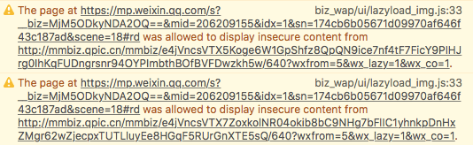

碰到了在 Safari 中 HTTPS 网站却没有显示锁头的情况，经查阅后发现是引用了 HTTP 资源的缘故。

<!--more-->

## 具体原因

我们可以从 Console 中看出 Safari 引用了 HTTP 资源导致了锁头标志的消失

## 参考

- [padlock on safari mobile not showing persistently - Stack Overflow](https://stackoverflow.com/questions/27518561/padlock-on-safari-mobile-not-showing-persistently)
