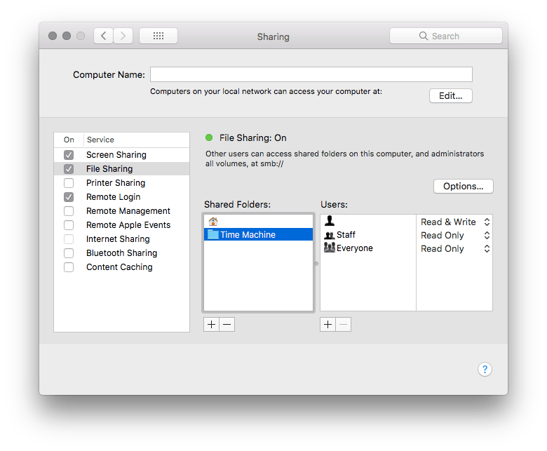
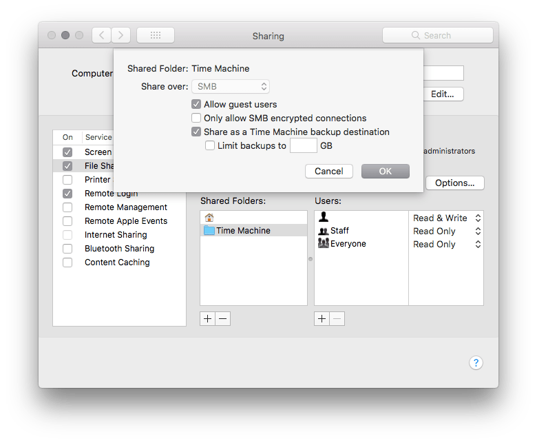

Time Machine 可以很方便的备份系统，但是假如没有 Time Capsule 或者 NAS 时，也可以备份到另一台 Mac 的硬盘上。

<!--more-->

## 操作步骤

在 Time Machine 备份存放的目的地的电脑上打开`系统偏好设置`，选择`共享`并选择`文件共享`。添加你想要备份的目的地。

对目标文件夹右键，选择高级选项。勾选`作为 Time Machine 目的地共享`，同时可以设置备份最大容量。这样就可以将另一台 Mac 作为 Time Machine 的备份目的地了。

