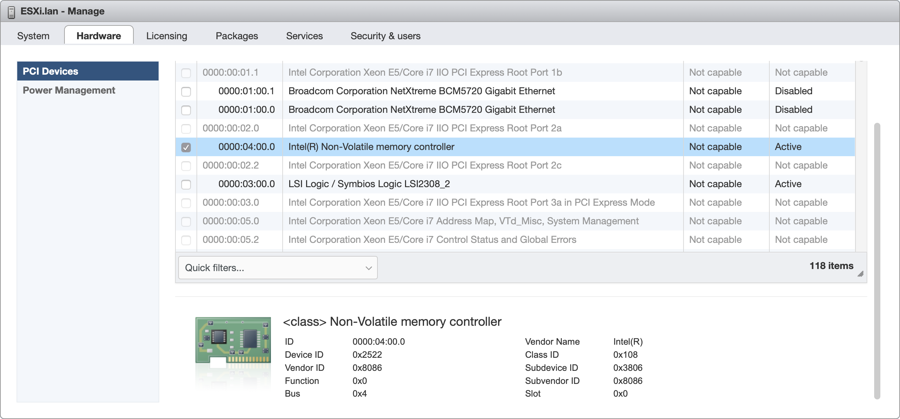

购买了一个 Optane M10 16GB 用来给 TrueNAS 做 L2ARC，但是将 Optane M10 直通给 TrueNAS 后出现了 `nvme0: Missing Interrupt` 的错误，并且无法正常进入系统。

<!--more-->

## 解决方案

### 修改 vmx

修改 TrueNAS `vmx` 文件中的 `pciPassthru0.msiEnabled` 为 `FALSE`。（假定 Optane 为直通的第一个设备，若是第二个直通则为 `pciPassthru1.msiEnabled`，以此类推。）

### 设置 passthru.map

修改 ESXi 的 `/etc/vmware/passthru.map` 文件，在最后添加上一行

```
# Optane M10
8086 2700 d3d0 false
```

其中 `8086` 为 Intel 的厂商 ID，`2522` 为 Optane M10 的设备 ID（需根据不同 Optane 设备的 ID 进行设置）。

可进入 ESXi 中的 Manage - Hardware - PCI Devices 中查看设备 ID。



## 参考

[Bug #26508: Intel Optane 900p will not work in ESX passthrough - FreeNAS - iXSystems & FreeNAS Redmine](http://redmine.ixsystems.com/issues/26508)
