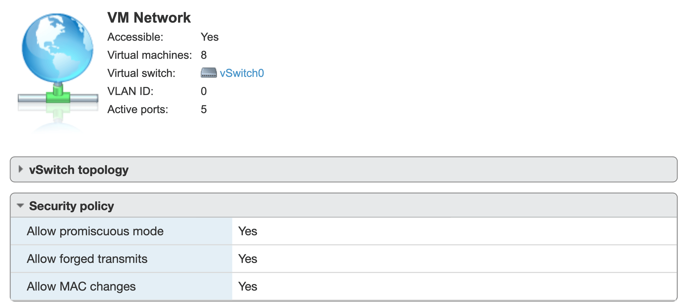

当使用 TrueNAS over ESXi 创建 Plugin/Jails 并选择网络获取方式为 DHCP 时，会出现无法创建的情况，这是因为 ESXi 的网卡设置中禁止了混杂模式

<!--more-->

## 错误提示

```
Acquiring DHCP address: FAILED, address received: 0.0.0.0/8 Stopped jail due to DHCP failure
```

## 解决方案

打开 TrueNAS 对应 ESXi 中的端口组混杂模式选项。


