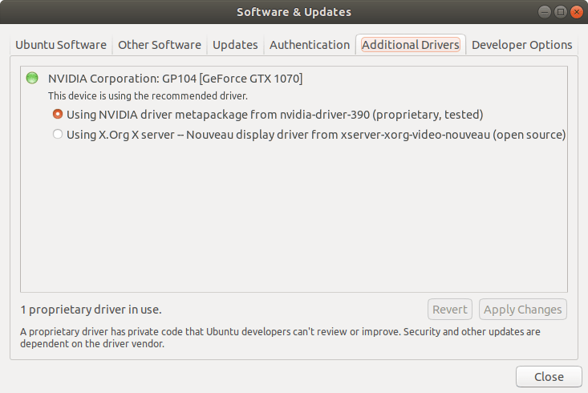

在 Ubuntu 18.04 上安装 TensorFlow GPU 的过程中遇到几个问题，在此将过程记录下来。

<!--more-->

## 前言

本文写于 2018 年 7 月，此时的 TensorFlow 最新版本为 1.9，此版本支持 [CUDA Toolkit 9.0](https://developer.nvidia.com/cuda-90-download-archive) 和 [cuDNN SDK v7](http://developer.nvidia.com/cudnn)。同时由于本人所安装的 Ubuntu 为英文版本，中文语言版本用户请寻找对应的程序位置。

## NVIDIA 显卡驱动

首先打开 `Software & Updates` 中的 `Additional Drivers` 选项卡，将显卡驱动更改为 `Using NVIDIA driver metapackage from nvidia-driver-390(proprietary, tested)`



当前最新版本为 390，版本可能不同，请选择对应的版本。

## CUDA 9.0

由于 TensorFlow 二进制包仅支持 CUDA 9.0，因此便选择 CUDA 9.0 进行安装。

下载地址：https://developer.nvidia.com/cuda-90-download-archive

选择 Linux - x86_64 - Ubuntu - 17.04 - runfile(local) 进行安装。

### 安装依赖

下载完成后安装依赖：

```bash
$ sudo apt install freeglut3-dev build-essential libx11-dev libxmu-dev libxi-dev libgl1-mesa-glx libglu1-mesa libglu1-mesa-dev
```

由于 CUDA 9.0 不支持 GCC 6 以后的版本，本文这里将 GCC 降级为 6。

```bash
$ sudo apt install gcc-6 g++-6
$ sudo update-alternatives --install /usr/bin/gcc gcc /usr/bin/gcc-6 60
$ sudo update-alternatives --install /usr/bin/g++ g++ /usr/bin/g++-6 60
```

### 运行安装脚本

```bash
$ sudo chmod a+x cuda_9.0.176_384.81_linux.run # 给予运行权限
$ sudo ./cuda_9.0.176_384.81_linux.run -toolkit -samples -silent -override
```

将 `cuda_9.0.176_384.81_linux.run` 修改为对应的文件名（一般来说是相同的）

### 设置环境变量

将下列环境变量添加到你的系统中，如 `~/.bashrc`，并运行 `source ~/.bashrc`

```
# CUDA PATH
export PATH=/usr/local/cuda-9.0/bin${PATH:+:${PATH}}
export LD_LIBRARY_PATH=${LD_LIBRARY_PATH:+${LD_LIBRARY_PATH}:}/usr/local/cuda-9.0/lib64
```

### 验证 CUDA 9.0 安装

首先运行 `nvcc -V` 查看 CUDA 版本，运行结果应如下所示：

```bash
$ nvcc -V
nvcc: NVIDIA (R) Cuda compiler driver
Copyright (c) 2005-2017 NVIDIA Corporation
Built on Fri_Sep__1_21:08:03_CDT_2017
Cuda compilation tools, release 9.0, V9.0.176
```

之后进入 `~/NVIDIA_CUDA-9.2_Samples` 下运行 `make` 命令进行编译。编译完成后进入 `~/NVIDIA_CUDA-9.0_Samples/bin/x86_64/linux/release` 运行 `./deviceQuery` 命令。运行结果应如下所示：

```
$ ./deviceQuery
./deviceQuery Starting...

 CUDA Device Query (Runtime API) version (CUDART static linking)

Detected 1 CUDA Capable device(s)

Device 0: "GeForce GTX 1070"
  CUDA Driver Version / Runtime Version          9.1 / 9.0
  CUDA Capability Major/Minor version number:    6.1
  Total amount of global memory:                 8111 MBytes (8505131008 bytes)
  (15) Multiprocessors, (128) CUDA Cores/MP:     1920 CUDA Cores
  GPU Max Clock rate:                            1683 MHz (1.68 GHz)
  Memory Clock rate:                             4004 Mhz
  Memory Bus Width:                              256-bit
  L2 Cache Size:                                 2097152 bytes
  Maximum Texture Dimension Size (x,y,z)         1D=(131072), 2D=(131072, 65536), 3D=(16384, 16384, 16384)
  Maximum Layered 1D Texture Size, (num) layers  1D=(32768), 2048 layers
  Maximum Layered 2D Texture Size, (num) layers  2D=(32768, 32768), 2048 layers
  Total amount of constant memory:               65536 bytes
  Total amount of shared memory per block:       49152 bytes
  Total number of registers available per block: 65536
  Warp size:                                     32
  Maximum number of threads per multiprocessor:  2048
  Maximum number of threads per block:           1024
  Max dimension size of a thread block (x,y,z): (1024, 1024, 64)
  Max dimension size of a grid size    (x,y,z): (2147483647, 65535, 65535)
  Maximum memory pitch:                          2147483647 bytes
  Texture alignment:                             512 bytes
  Concurrent copy and kernel execution:          Yes with 2 copy engine(s)
  Run time limit on kernels:                     Yes
  Integrated GPU sharing Host Memory:            No
  Support host page-locked memory mapping:       Yes
  Alignment requirement for Surfaces:            Yes
  Device has ECC support:                        Disabled
  Device supports Unified Addressing (UVA):      Yes
  Supports Cooperative Kernel Launch:            Yes
  Supports MultiDevice Co-op Kernel Launch:      Yes
  Device PCI Domain ID / Bus ID / location ID:   0 / 1 / 0
  Compute Mode:
     < Default (multiple host threads can use ::cudaSetDevice() with device simultaneously) >

deviceQuery, CUDA Driver = CUDART, CUDA Driver Version = 9.1, CUDA Runtime Version = 9.0, NumDevs = 1
Result = PASS
```

以及 `./bandwidthTest` 命令：

```
$ ./bandwidthTest
[CUDA Bandwidth Test] - Starting...
Running on...

 Device 0: GeForce GTX 1070
 Quick Mode

 Host to Device Bandwidth, 1 Device(s)
 PINNED Memory Transfers
   Transfer Size (Bytes)	Bandwidth(MB/s)
   33554432			12510.8

 Device to Host Bandwidth, 1 Device(s)
 PINNED Memory Transfers
   Transfer Size (Bytes)	Bandwidth(MB/s)
   33554432			12739.0

 Device to Device Bandwidth, 1 Device(s)
 PINNED Memory Transfers
   Transfer Size (Bytes)	Bandwidth(MB/s)
   33554432			181601.2

Result = PASS

NOTE: The CUDA Samples are not meant for performance measurements. Results may vary when GPU Boost is enabled.
```

## cuDNN v7

前往 https://developer.nvidia.com/rdp/cudnn-archive 下载对应的 cuDNN，点击 "Download cuDNN v7.0.5 (Dec 5, 2017), for CUDA 9.0"，下载以下三个链接。

- [cuDNN v7.0.5 Runtime Library for Ubuntu16.04 (Deb)](https://developer.nvidia.com/compute/machine-learning/cudnn/secure/v7.0.5/prod/9.0_20171129/Ubuntu16_04-x64/libcudnn7_7.0.5.15-1+cuda9.0_amd64)
- [cuDNN v7.0.5 Developer Library for Ubuntu16.04 (Deb)](https://developer.nvidia.com/compute/machine-learning/cudnn/secure/v7.0.5/prod/9.0_20171129/Ubuntu16_04-x64/libcudnn7-dev_7.0.5.15-1+cuda9.0_amd64)
- [cuDNN v7.0.5 Code Samples and User Guide for Ubuntu16.04 (Deb)](https://developer.nvidia.com/compute/machine-learning/cudnn/secure/v7.0.5/prod/9.0_20171129/Ubuntu16_04-x64/libcudnn7-doc_7.0.5.15-1+cuda9.0_amd64)

下载完成后进行安装：

```
$ sudo dpkg -i libcudnn7_7.0.5.11-1+cuda9.0_amd64.deb
$ sudo dpkg -i libcudnn7-dev_7.0.5.11-1+cuda9.0_amd64.deb
$ sudo dpkg -i libcudnn7-doc_7.0.5.11-1+cuda9.0_amd64.deb
```

## 安装 TensorFlow

### 安装 `libcupti-dev` 依赖

```
sudo apt-get install libcupti-dev
```

并将以下环境变量加入系统：

```
export LD_LIBRARY_PATH=${LD_LIBRARY_PATH:+${LD_LIBRARY_PATH}:}/usr/local/cuda/extras/CUPTI/lib64
```

### （可选）固定 cuDNN 版本：

运行以下命令固定 cuDNN 版本

```bash
$ sudo apt-mark hold libcudnn7 libcudnn7-dev libcudnn7-doc
```

取消固定：

```bash
$ sudo apt-mark unhold libcudnn7 libcudnn7-dev libcudnn7-doc
```

### TensorFlow GPU

运行以下命令：

```bash
$ pip3 install tensorflow-gpu
```

在 Python 中验证安装：

```
import tensorflow as tf
with tf.Session() as sess:
     print(sess.run(tf.constant('Hello, TensorFlow!')))
```

运行结果应如下所示：

```
/home/ubuntu/.pyenv/versions/3.6.6/lib/python3.6/importlib/_bootstrap.py:219: RuntimeWarning: numpy.dtype size changed, may indicate binary incompatibility. Expected 96, got 88
  return f(*args, **kwds)
/home/ubuntu/.pyenv/versions/3.6.6/lib/python3.6/importlib/_bootstrap.py:219: RuntimeWarning: numpy.dtype size changed, may indicate binary incompatibility. Expected 96, got 88
  return f(*args, **kwds)
2018-07-31 03:55:51.119408: I tensorflow/core/platform/cpu_feature_guard.cc:141] Your CPU supports instructions that this TensorFlow binary was not compiled to use: AVX2 FMA
2018-07-31 03:55:51.218358: I tensorflow/stream_executor/cuda/cuda_gpu_executor.cc:897] successful NUMA node read from SysFS had negative value (-1), but there must be at least one NUMA node, so returning NUMA node zero
2018-07-31 03:55:51.218692: I tensorflow/core/common_runtime/gpu/gpu_device.cc:1392] Found device 0 with properties:
name: GeForce GTX 1070 major: 6 minor: 1 memoryClockRate(GHz): 1.683
pciBusID: 0000:01:00.0
totalMemory: 7.92GiB freeMemory: 7.33GiB
2018-07-31 03:55:51.218705: I tensorflow/core/common_runtime/gpu/gpu_device.cc:1471] Adding visible gpu devices: 0
2018-07-31 03:55:52.587414: I tensorflow/core/common_runtime/gpu/gpu_device.cc:952] Device interconnect StreamExecutor with strength 1 edge matrix:
2018-07-31 03:55:52.587483: I tensorflow/core/common_runtime/gpu/gpu_device.cc:958]      0
2018-07-31 03:55:52.587518: I tensorflow/core/common_runtime/gpu/gpu_device.cc:971] 0:   N
2018-07-31 03:55:52.587926: I tensorflow/core/common_runtime/gpu/gpu_device.cc:1084] Created TensorFlow device (/job:localhost/replica:0/task:0/device:GPU:0 with 7077 MB memory) -> physical GPU (device: 0, name: GeForce GTX 1070, pci bus id: 0000:01:00.0, compute capability: 6.1)
b'Hello, TensorFlow!'
```

## 参考

- [Install TensorFlow on Ubuntu  |  TensorFlow](https://www.tensorflow.org/install/install_linux)
- [NVIDIA CUDA Installation Guide for Linux](https://docs.nvidia.com/cuda/cuda-installation-guide-linux/index.html)
