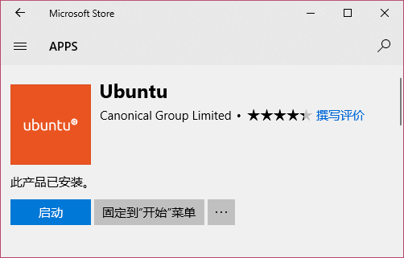
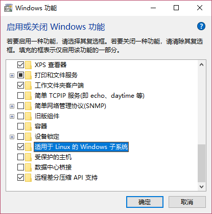

新装了一台 Windows 机器，在 Windows 上面开启了 Windows Subsystem for Linux，WSL 允许我们在 Windows 上运行 Linux 子系统，虽然这个子系统有挺多缺陷，如后台程序的问题，但运行一些简单的事情如 ssh 还是非常方便的。这篇文章就作为 Windows 安装 WSL 的一个备忘吧。

<!--more-->

## 开启 WSL

在 Microsoft Store 中下载自己喜欢的发型版，这里我选择了 Ubuntu.



在 `启用或关闭 Windows 功能` 中打开 `适用于 Linux 的 Windows 子系统` ，并重启。



## 更改终端外观

参见 [如何修改 Windows 命令行字体](/2017/12/03/如何修改-Windows-命令行字体/)

## 链接硬盘

此步非必须，只是为了方便在 Linux 中对本地磁盘的操作。
在 Linux 中执行

```bash
$ mkdir ~/win
$ ln -s /mnt/c ~/win/c
```

## 更改 apt 源

```bash
$ sudo cp /etc/apt/sources.list /etc/apt/sources.list
$ sudo sed -i 's/archive.ubuntu.com/mirrors.ustc.edu.cn/g' /etc/apt/sources.list
$ sudo sed -i 's/security.ubuntu.com/mirrors.ustc.edu.cn/g' /etc/apt/sources.list
```

## 安装 oh-my-zsh

```bash
$ sudo apt install zsh
$ curl -L https://raw.github.com/robbyrussell/oh-my-zsh/master/tools/install.sh | sh
$ chsh -s /bin/zsh
```

### 注意事项

- WSL 环境修改默认 shell，参见 [Windows Subsystem for Linux (WSL) 设置 zsh 为默认 shell](/2018/02/05/Windows-Subsystem-for-Linux-WSL-设置-zsh-为默认-shell/)

- oh-my-zsh 插件 autojump 在 WSL 环境下会出错，解决方法参见 [WSL 中 autojump 出现 autojump_chpwd:4: nice(5) failed: operation not permitted 的解决方案](/2018/02/01/WSL-中-autojump-出现-autojump-chpwd-4-nice-5-failed-operation-not-permitted-的解决方案/)

## 安装 Python

参见 [python pyenv virturalenv 安装、设置与使用](/2018/02/01/python-pyenv-virturalenv-安装、设置与使用/)

## 最后

这只是个人的记录性质的文章，记录了一些遇到的小坑，希望能帮到你。
