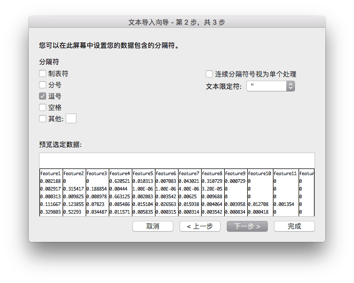

Microsoft Excel on macOS doesn't provide a direct way to set character encoding when opening files. This makes it challenging to properly open UTF-8 encoded CSV files. However, there's a workaround using Excel's `Get External Data` feature that allows you to successfully open UTF-8 CSV files.

<!--more-->

## Steps

1. Create a new blank Excel workbook
2. Navigate to the `Data` tab and select `Get External Data > Import Text File...`

3. Locate and select your CSV file. In the import wizard, choose `Unicode (UTF-8)` as the file origin, then click Next.

4. In the next screen, select your desired delimiter options, then click Finish.

That's it! Your UTF-8 CSV file should now be properly imported with all characters displaying correctly.
