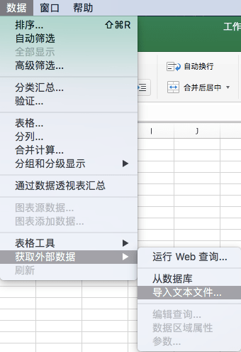
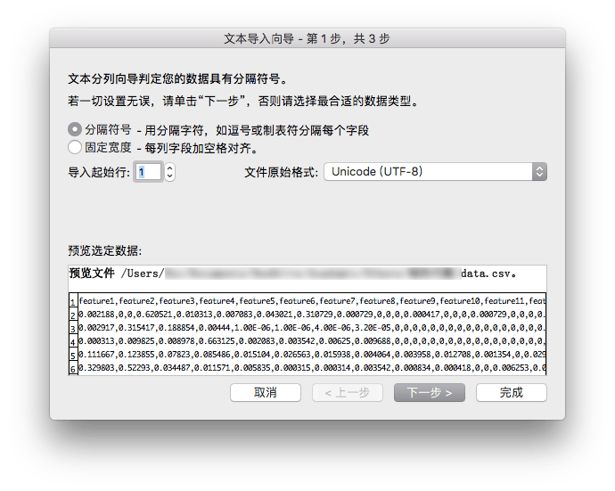

macOS 下使用 Microsoft Excel 打开 UTF-8 CSV 文件时，由于 Excel 自身无法设置 charset, 因此无法正常打开 CSV 文件。可以通过 Excel 的 `获取外部数据` 选项曲线救国，打开 UTF-8 CSV 文件。

<!--more-->

## 操作步骤

首先新建一个空白的 Excel 文档。选取 `数据-获取外部数据-导入文本文件…` 选项卡。

打开所需的 CSV 文件后，选择文件原始格式为 `Unicode (UTF-8)`，并下一步。

选取分隔符，然后完成。

Done!
