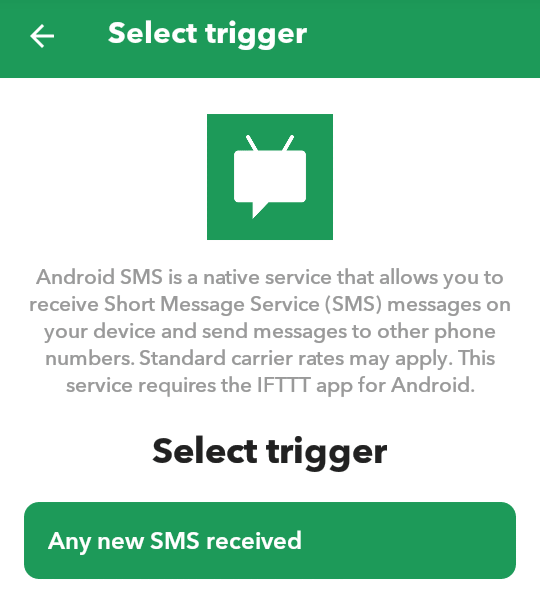
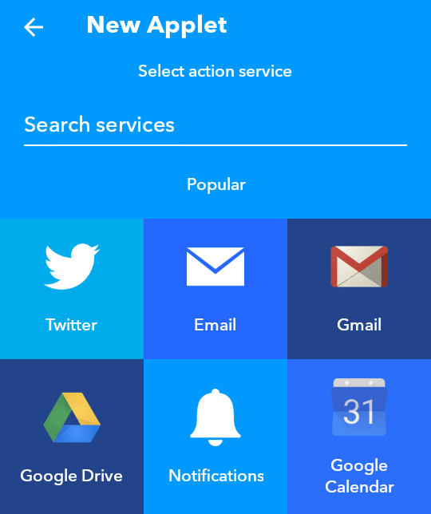
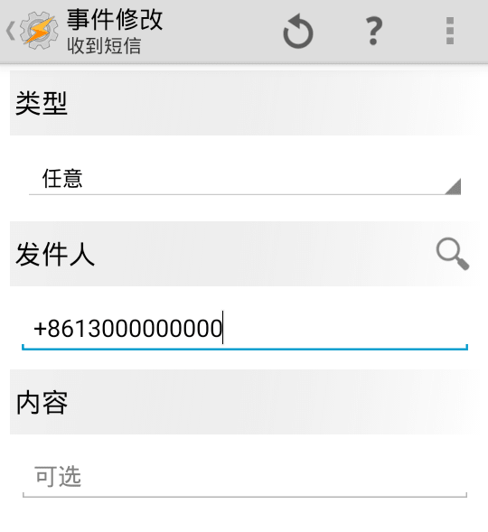

博主在办理了大王卡之后便准备将原来的移动卡停用，电话可以通过呼叫转移进行解决，但一直困扰于短信如何转发的问题。如今市面上有几种解决方案：

1.  [双享号](http://www.186life.com)
2.  [iOS 信息转发](https://support.apple.com/zh-cn/HT204681)
3.  随身携带备用机

其中双享号方案只支持联通手机卡，iOS 信息转发则需要有闲置的 iPhone 设备，随身携带备用机则过于繁琐。正好身边有闲置的 Android 手机，便使用 Android 手机搭配 [Tasker](https://play.google.com/store/apps/details?id=net.dinglisch.android.taskerm) 和 [IFTTT](https://ifttt.com) 进行短信的转发和代发。

<!--more-->

## 配置 IFTTT 实现短信转发

Tasker 本身也具有短信转发的功能，可参见 [Tasker 实现短信转发到邮件](http://www.jianshu.com/p/287869c6486f)，但 Tasker 相较 IFTTT 而言易用性和拓展性均稍逊一筹，便使用 IFTTT 进行短信的转发。

在 Android 上安装 IFTTT 并注册后，若手机系统为 MIUI, 则修改 IFTTT 的权限为允许读取通知类短信，并允许其后台常驻。

打开 IFTTT，选择 My Applets 选项卡，并点击右上角的加号进行添加 Applet。

点击 this 后选择 Android SMS，并点选 Any new SMS received.

之后点击 that 选择短信转发的目的地，此处可以选择 Notification, Email 或 Telegram 等多种方式

Notification 方式需要在主力机上安装 IFTTT, Telegram 作为即时通讯工具来转发短信是很合适的，但是对于无法科学上网的用户则不太友好，Email 的及时性则不如前面两种方式，特别是在收发验证码等特别需要及时性的场合。

## 使用 Tasker 进行短信代发

下载 Tasker 配置文件：

- 从 GitHub Gist 进行下载：[下载链接](https://gist.github.com/seedgou/3a00b42275ce6363af1d185455b92059)
- 从本站进行下载：[下载链接](./SMS_forwarding.prf.xml)

使用时将配置文件中的发件人修改为自己的主力机号码

使用方法为由主力机向备用机发送短信，格式为：
`13000000000:这是示范短信`

注：Tasker 对双卡双待手机支持似乎不大完善，当手机卡在 SIM 2 卡槽时，即使将 SIM 2 设为默认卡，也会出现显示短信已发送但实际上并没发送的情况。

注 2：由于 Tasker 规则编写的较为简陋，因此在此脚本中，短信内容中不能出现`:`，此问题可以通过变量切割后拼接除第一个变量的剩余变量解决，也可更改分割符号为不常用的字符解决，如以 emoji 字符`🇦🇱`作为分隔符。
