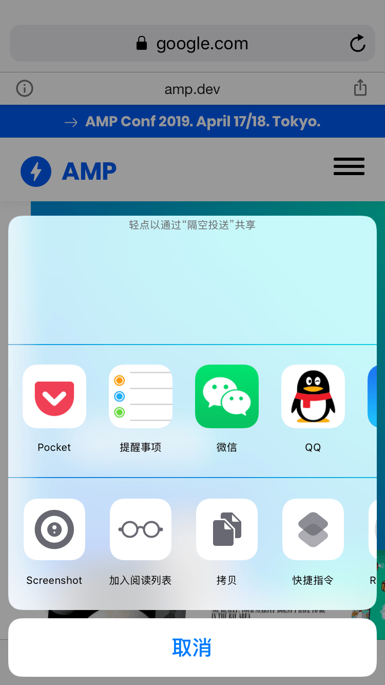

偶然发现 Google AMP 界面中打开源网站的按钮已经变成了分享，查阅后才知道 iOS 12.2 中 Safari 支持了 Web Share API。于此同时也支持了 TLS 1.3，当然这是题外话了。

<!--more-->

## 分享效果

具体 Web Share API 的使用方法可以参见 [Introducing the Web Share API | Web | Google Developers](https://developers.google.com/web/updates/2016/09/navigator-share)

## 参考

- [Web Share API - caniuse](https://caniuse.com/#feat=web-share)
- [WebKit platform status: Supported in Preview ](https://webkit.org/status/#feature-web-share)
