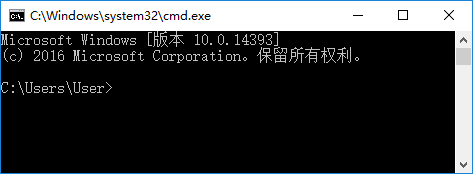
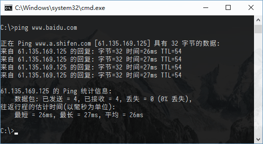
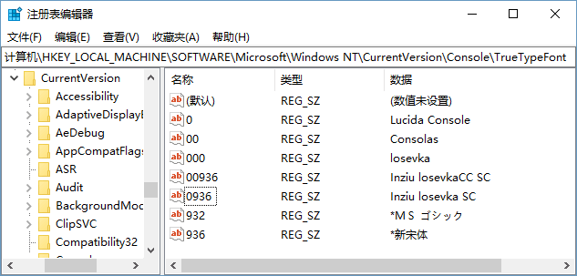
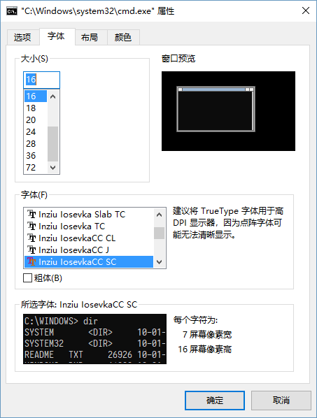

Windows 命令行从 Windows XP 以来一直都是不怎么好看的点阵字体，之所以难以自定义自己喜欢的字体是因为 Windows 对控制台的字体有着近乎变态的要求（参见 [Necessary criteria for fonts to be available in a command window](https://support.microsoft.com/zh-cn/help/247815/necessary-criteria-for-fonts-to-be-available-in-a-command-window) ），好在 [Belleve Invis](https://github.com/be5invis/) 设计出了一套不错的符合 Windows 要求的字体 [Inziu Iosevka](https://be5invis.github.io/Iosevka/inziu.html)（此项目现已不再更新，转移至 [Sarasa Gothic](https://github.com/be5invis/Sarasa-Gothic) 。）

<!--more-->

## 字体效果

修改前：


修改后：


## 如何修改

注： 本文仍将以 Inziu Iosevka 为例修改命令行字体，请自行更改为 Sarasa Gothic 字体。

首先前往[项目主页](https://be5invis.github.io/Iosevka/inziu.html)下载字体并安装至系统中。

然后前往注册表（按下 `Win + R` 并执行 `regedit`）然后前往

```
HKLM\SOFTWARE\Microsoft\Windows NT\CurrentVersion\Console\TrueTypeFont
```

添加图示注册表项至注册表中。



注：其中名称一栏可随意填写。

然后打开 CMD， 对标题栏点击右键并选择属性，选择字体选项卡，并选择自己偏好的字体。



使用 Powershell 的用户也可以进行同样的操作更改 Powershell 的字体。

## 参考资料

1. [为什么 Windows 下 cmd 和 PowerShell 不能方便地自定义字体？- 知乎](https://www.zhihu.com/question/36344262)
