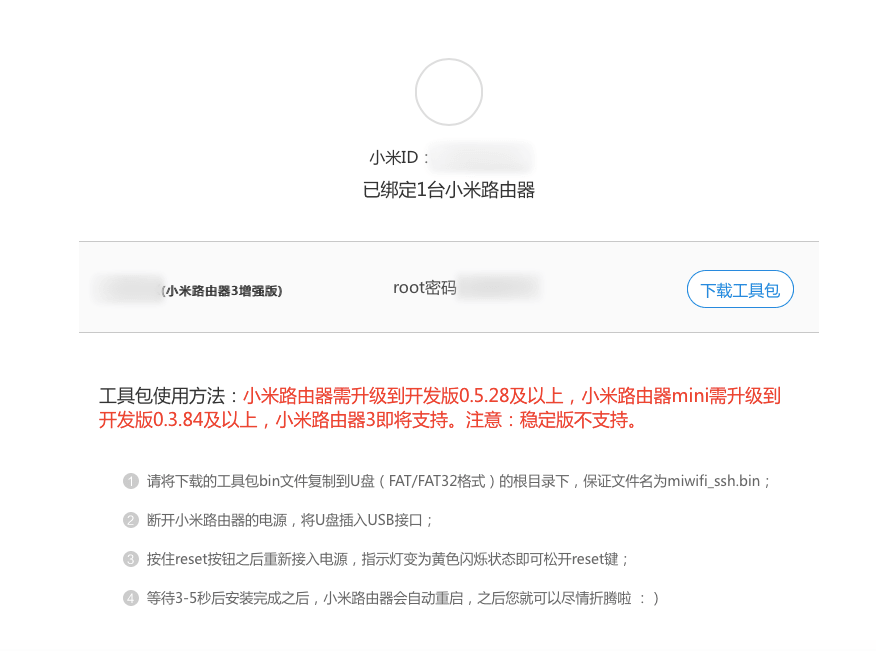

购买了一个[小米路由器 3G](https://www.mi.com/miwifi3g/)，购买后才发现当时并不支持 OpenWrt，最近 OpenWrt 18.04 终于添加了对 OpenWrt 的稳定支持，将安装的过程在此记录下来。

<!--more-->

## 解锁 SSH 并安装开发版

首先将小米路由器的 SSH 权限解锁

前往 [MiWiFi 开启 SSH 工具](https://d.miwifi.com/rom/ssh) 登陆小米账号查看自己的 root 密码



并按照网页提示安装小米路由器开发版。

## 下载 OpenWrt

下载以下两个文件至 U 盘中，并将 U 盘插入至路由器中

- [openwrt-18.06.1-ramips-mt7621-mir3g-squashfs-rootfs0.bin](https://mirrors.tuna.tsinghua.edu.cn/lede/releases/18.06.1/targets/ramips/mt7621/openwrt-18.06.1-ramips-mt7621-mir3g-squashfs-rootfs0.bin)
- [openwrt-18.06.1-ramips-mt7621-mir3g-squashfs-kernel1.bin](https://mirrors.tuna.tsinghua.edu.cn/lede/releases/18.06.1/targets/ramips/mt7621/openwrt-18.06.1-ramips-mt7621-mir3g-squashfs-kernel1.bin)

## 安装 OpenWrt

`ssh root@192.168.31.1` 到路由器上，运行以下命令

```sh
cd /extdisks/sda1/
mtd write /extdisks/sda1/lede-ramips-mt7621-mir3g-squashfs-kernel1.bin kernel1
mtd write /extdisks/sda1/lede-ramips-mt7621-mir3g-squashfs-rootfs0.bin rootfs0
nvram set flag_try_sys1_failed=1
nvram commit
reboot
```

运行完成后路由器会重启，OpenWrt 安装完成，同时路由器 IP 会变成 `192.168.1.1`

## 参考

- [OpenWrt Project: Xiaomi Mi WiFi R3G (Mi Wifi Router 3G / MIR3G / MI3G)](https://openwrt.org/toh/xiaomi/mir3g)
- [Xiaomi WiFi Router 3G - For Developers - OpenWrt Forum](https://forum.openwrt.org/t/xiaomi-wifi-router-3g/5377)
