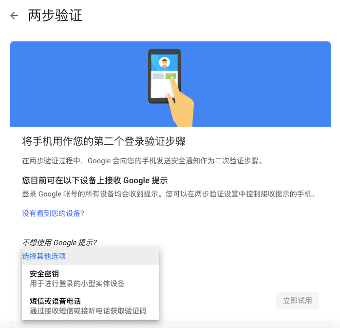
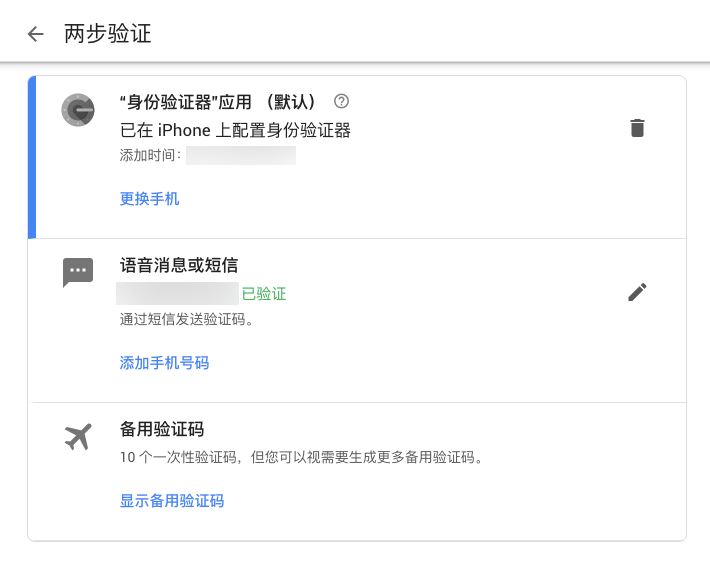

2FA 可以大大增加账户的安全性，但是最近 Google 在其账户安全中隐藏了使用 Google Authenticator (TOTP) 和 Backup Code 的选项。只保留了电话因此需要通过其他变通方法添加 TOTP

<!--more-->

## 操作步骤

当我们设置两步验证时，我们可以看到选项只剩下了“Google 提示”、“安全密钥“和“语音消息或短信”，而缺少了”’身份验证器‘应用“与“备用验证码”的选项。

这时候我们先选择其中一个，如语音消息或短信，在设置成功后，将进入如下图所示的页面。（这里我已经设置好 TOTP 了）

在下面的“设置其他类型的第二个验证步骤”中设置“身份验证器“应用（TOTP），并可以选择是否将之前添加的两步验证删除。
