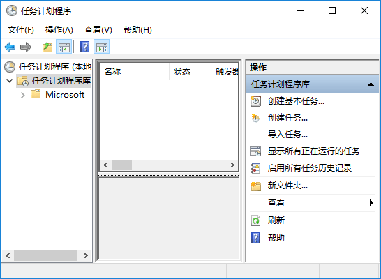
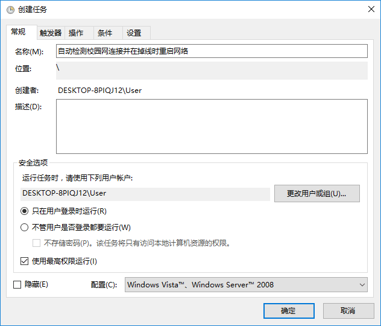
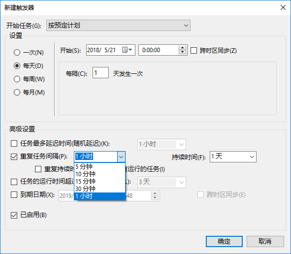
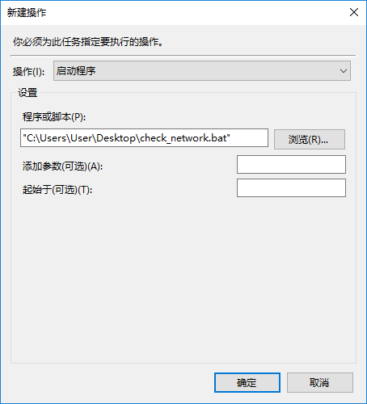

学校的无线网质量不好，而有线网只能使用 iNode 进行连接。因此便买了台 x86 小主机专职路由器用，但有线网在 24 小时后会被强制断线，只能重启 iNode 进行连接。最初的解决方案为定时重启电脑，但由于 iNode 认证有几率失败，还是需要检测网络的联通性。因此便写了个小脚本自动检测校园网连接并在掉线时重启网络。

<!--more-->

## 脚本内容

```
ping 114.114.114.114 | findstr TTL= && goto:networkup || goto :networkdown

:networkup
echo Network is up
goto :endofscript

:networkdown
echo Network is down
echo Restarting iNode...
taskkill /f /im "iNode Client.exe" /t
timeout 10
"C:\PROGRA~2\iNode\iNode Client\iNode Client.exe"
goto :endofscript

:endofscript
echo Script complete
```

## 使用方法

首先将脚本复制保存为后缀名为 `.bat` 的文件。

打开 Windows 任务计划程序，并选择“创建任务”



填入名称，并勾选“使用最高权限运行”



选择触发器选项卡，并新建触发器，按照如图所示设置，重复任务间隔可选择自定义的检测间隔。



选择操作选项卡，新建操作，将“程序或脚本”设置为脚本所在位置。



## 锐捷等其他校园网

将脚本中的 `iNode Client.exe`, `C:\PROGRA~2\iNode\iNode Client\iNode Client.exe` 修改为对应的校园网客户端文件名及文件路径。

## Gist

GitHub Gist 地址：[https://gist.github.com/rwv/19a77f42bbaf5fa5811d0516ec2ff5ee](https://gist.github.com/rwv/19a77f42bbaf5fa5811d0516ec2ff5ee)
