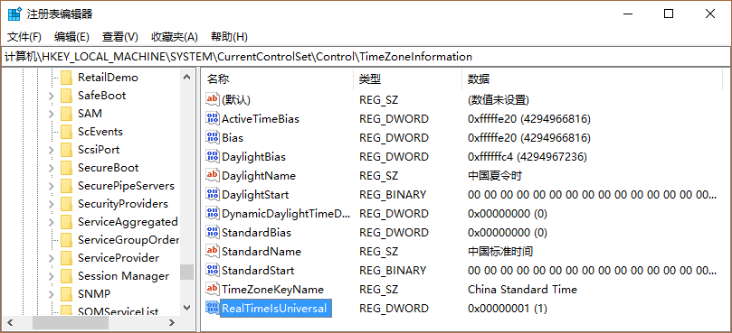

By default, macOS and Windows handle the system BIOS clock differently. macOS interprets the BIOS clock as UTC (Coordinated Universal Time), while Windows reads it as local time. For example, if the BIOS clock shows 00:00, Windows will display it as 00:00 local time. However, macOS will interpret this as 00:00 UTC and adjust it to show 08:00 for users in GMT+8 time zones (like Beijing time). This difference in interpretation causes the time to appear inconsistent between the two operating systems.

<!--more-->

## Solutions

### Method 1: Using Registry Editor

1. Open Registry Editor by pressing `Win + R` and typing `Regedit`
2. Navigate to: `HKLM\SYSTEM\CurrentControlSet\Control\TimeZoneInformation`
3. Create a new DWORD (32-bit) Value named `RealTimeIsUniversal`
4. Set its value to `1`



### Method 2: Using Command Prompt

Run the following command in an Administrator Command Prompt:

```
Reg add HKLM\SYSTEM\CurrentControlSet\Control\TimeZoneInformation /v RealTimeIsUniversal /t REG_DWORD /d 1
```

This change will make Windows treat the BIOS clock as UTC time, matching macOS's behavior.

## Reference

[MAC 系统同 WIN10 时间不一致的问题-远景论坛-微软极客社区](http://bbs.pcbeta.com/forum.php?mod=viewthread&tid=1695542)
