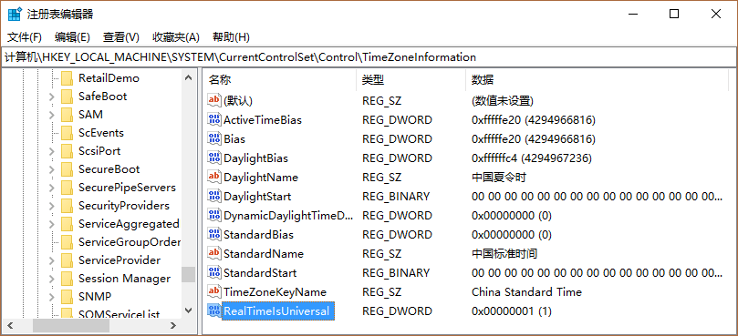

macOS 默认看待 BIOS 中的时间为 UTC 时间，而 Windows 则默认看待 BIOS 中的时间为本地时间。例如 BIOS 中的本地时间为 00:00，Windows 将会把此时间读取为本地时间，即 00:00。而 macOS 则会读取为 UTC 时间，本地时间则显示为 08:00 (GMT +8 北京时间)。这就导致了时间不一致情况的发生。

<!--more-->

## 解决方案

### 方案一

在 Windows `运行` (Win + R) 中执行 `Regedit` 打开注册表。在 `HKLM\SYSTEM\CurrentControlSet\Control\TimeZoneInformation` 中添加一项名称为 `RealTimeIsUniversal`，数据类型为 `REG_DWORD`，值为 `1` 的项。



### 方案二

在 Windows 管理员权限的命令行下执行以下命令：

```
Reg add HKLM\SYSTEM\CurrentControlSet\Control\TimeZoneInformation /v RealTimeIsUniversal /t REG_DWORD /d 1
```

## 参考

[MAC 系统同 WIN10 时间不一致的问题-远景论坛-微软极客社区](http://bbs.pcbeta.com/forum.php?mod=viewthread&tid=1695542)
